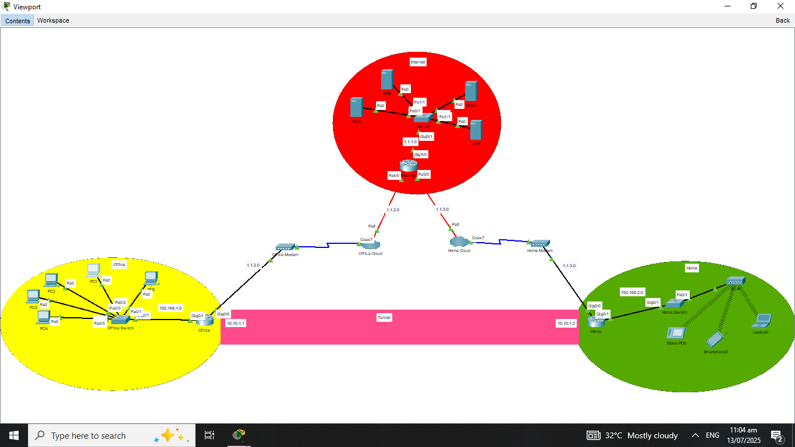

# IT-Networking-Site-to-Site-VPN

## Description
This project demonstrates a complete network topology setup using:
- **3 Router**
- **3 Switches**
- **End Devices**
- **4 Servers**

The configuration includes **Dynamic Host Configuration Protocol (DHCP)**, **VLAN**, **VPN**, **OSPf**, and **SSH**. Designed and simulated using **Cisco Packet Tracer**, this setup is ideal for Implementing the past projects in real life topology or infrastructure.

---

## Project Objectives
- Design Small Enterprise Network Infrastuctures
- Set up Virtual Private Network
- Configure OSPF, DNS, DHCP, and Servers
- Test connection between devices and accross networks
- Access SSH from Network End devices
---

## Repository Contents

# Configurations/
- **Internet.txt**
- **Office.txt**
- **Home.txt**
- **Office Switch.txt**
- **Home Switch.txt**

# IT Networking Source File/
- **IT Network 4 (Site to Site VPN).pkt**

# Overview

# README.md

## Tools Used
- **Cisco Packet Tracer** – for simulation and design
- **Text Editor** – for writing and reviewing CLI configs

---

## How to Use
1. Open the `IT Network 4 (Site to Site VPN.pkt)` file using **Cisco Packet Tracer**.
2. Check Network devices if they have IP Address, VLANs, and SSH.
3. Analyze the Topology and try to ping each devices.
4. Test SSH from the Network PC by logging the username and password in SSH/Telnet Tab.
5. Try to access web server using itnetwork.gmail.com in End devices using Browser.
6. Try to email each username with itnetwork.gmail.com within the Network using Email Tab.
7. Try FTP in each PC using ftp 1.1.1.5 im Command Prompt Tab.
---

## Author
**[ITArchitect111](https://github.com/ITArchitect111)**  
BS in Information Systems – Isabela, Philippines  
**TikTok**: [@it_ako123](https://www.tiktok.com/@it_ako123)

---

## License
This project is provided for educational purposes only.  
Feel free to fork or adapt it with proper credit.
